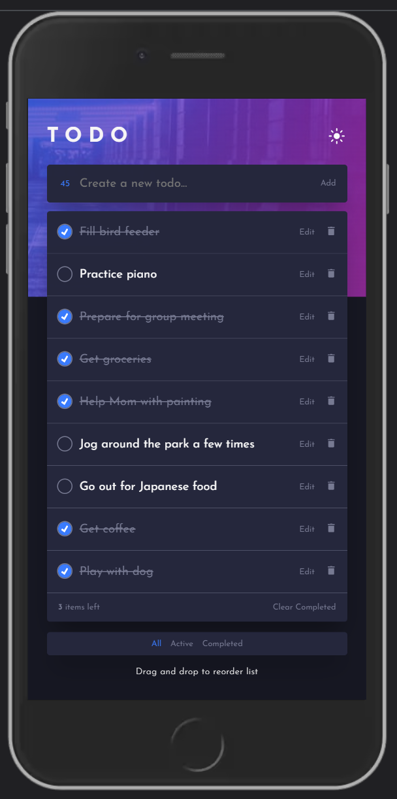

<h1 align='center'>Task Manager</h1>

  <h3>
    <a href="https://task-manager-fm.netlify.app/" target="_blank" color="white">
      Live Link
    </a>
  </h3>

   A task manager or todo application with extra features based on a challenge from <a href="https://www.frontendmentor.io/challenges/todo-app-Su1_KokOW" target="_blank">frontendmentor.io</a>.

 
 

</img>

 
 

## 💡 Technologies:

    

 

- useReducer()
- Custom hook
- ThemeProvider
- Responsive Design
- Local Storage
- <a href="https://www.framer.com/motion/" color="white">
      Framer Motion
    </a>

## 📄 Description

This is a classic task manager application with some extra functionality perks. I've included a dark/light theme toggle and the ability to drag and drop tasks to reorder their priority. I also added a bit of animation to provide more interactivity throughout the application and a modal to confirm all deletions.
 

## ⚙ Functionality

Users can...

- Add new tasks to their todo list and view them upon refreshing the page
- Edit existing tasks on the fly
- Delete existing tasks
- Mark existing tasks as complete
- Delete all tasks marked as completed
- Drag and drop tasks to reorder them
- Filter tasks by all, active, and completed tasks
- Toggle between dark and light theme
- View the application on desktop and mobile devices
- See how many todos remain to be completed
- See how many characters remain for their typed task

## 💻 Concepts

I built this project to practice React core concepts, but also to get more comfortable with state management and the useReducer hook, custom hooks, styled components, and drag and drop technology.

## 📷 Screenshots

### Base Application (Light Theme)

 
 

### Completed Filter (Dark Theme)

 
 

### Delete Modal (Dark Theme)

 
 

### Editing State (Dark Theme)

 
 

### Mobile Base Application (Dark Theme)

 
 

## Questions and Feedback:

Feel free to contact me at mully7773@gmail.com if you have any questions or feedback.  
You can view more of my projects at https://github.com/Mully7773.
